<h3>Web scraping: https://www.uceprotect.net/en/rblcheck.php

##Python

<h4>Libraries:

>import requests 
from bs4 import BeautifulSoup 
import time

Website: https://www.uceprotect.net/en/rblcheck.php

Extracting IPs Listed in uceprotect website by python web scraping. 
For test:
> Run source code and input your AS number

<h4>Email: 
>prognet32021@gmail.com 
>arda1.zamanpour@gmail.com

 
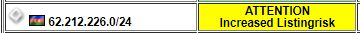 
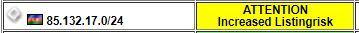 
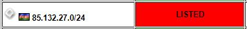 
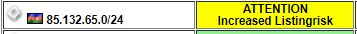 
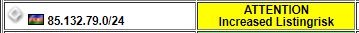 
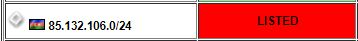 
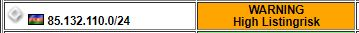 
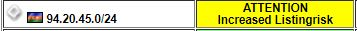 
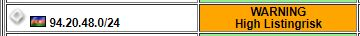 
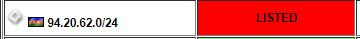 
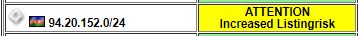 

